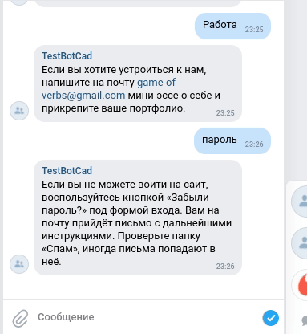

# Support Bots

Боты для службы поддержки Телеграм бот `tg_bot.py` [инструкция как создать бота](https://way23.ru/%D1%80%D0%B5%D0%B3%D0%B8%D1%81%D1%82%D1%80%D0%B0%D1%86%D0%B8%D1%8F-%D0%B1%D0%BE%D1%82%D0%B0-%D0%B2-telegram.html) и ВКонтакте бот `vk_bot.py` создаете новую группу ВКонтакте, в настройках группы нужно включить "сообщения сообщества". Боты используют заранее заготовленные ответы на вопросы пользователей используя API goole
приложения DialogFlow. Для использования DialogFlow нужно иметь аккаунт google.com, [затем нужно создать проект в Google Cloud Platform и зарегистрироваться на сайте DialogFlow](https://cloud.google.com/dialogflow/es/docs/quick/setup), создать [агента DialogFlow](https://cloud.google.com/dialogflow/es/docs/quick/build-agent). 

Примеры работы ботов:




#### create_intent.py

Скрипт для обучения бота тренировочным фразам с использованием файла формата `json`.

Пример `questions.json`:

```
{
    "Устройство на работу": {
        "questions": [
            "Как устроиться к вам на работу?",
            "Как устроиться к вам?",
            "Как работать у вас?",
            "Хочу работать у вас",
            "Возможно-ли устроиться к вам?",
            "Можно-ли мне поработать у вас?",
            "Хочу работать редактором у вас"
        ],
        "answer": "Если вы хотите устроиться к нам, напишите на почту game-of-verbs@gmail.com мини-эссе о себе и прикрепите ваше портфолио."
    },
}
```

### Чувствительные данные

Для хранения используем переменные окружения и файл .env

Пример файла .env:

`TG_TOKEN= токен вашего телеграм бота` Можно получить у [@BotFather](https://way23.ru/%D1%80%D0%B5%D0%B3%D0%B8%D1%81%D1%82%D1%80%D0%B0%D1%86%D0%B8%D1%8F-%D0%B1%D0%BE%D1%82%D0%B0-%D0%B2-telegram.html)

`GOOGLE_APPLICATION_CREDENTIALS=файла учетных данных google в формате json` [Инструкция по созданию json ключа](https://cloud.google.com/docs/authentication/getting-started)

`TG_CHAT_ID=ваш чат id` Сюда телеграм бот будет слать уведомления об ошибках

`PROJECT_ID=project_id` из вашего файла GOOGLE_APPLICATION_CREDENTIALS

`VK_TOKEN=Токен ВКонтакте` Можно получить в настройках группы "Работа с API"->"Ключи доступа"

### Как установить

Python3 должен быть установлен затем используйте `pip`

```bash
pip install -r requirements.txt
```

### Как запустить

```bash
python vk_bot.py
```

```bash
python tg_bot.py
```
```bash
create_intent.py
```

### Цель проекта

Код написан в образовательных целях на онлайн-курсе для веб-разработчиков [dvmn.org](https://dvmn.org/).
